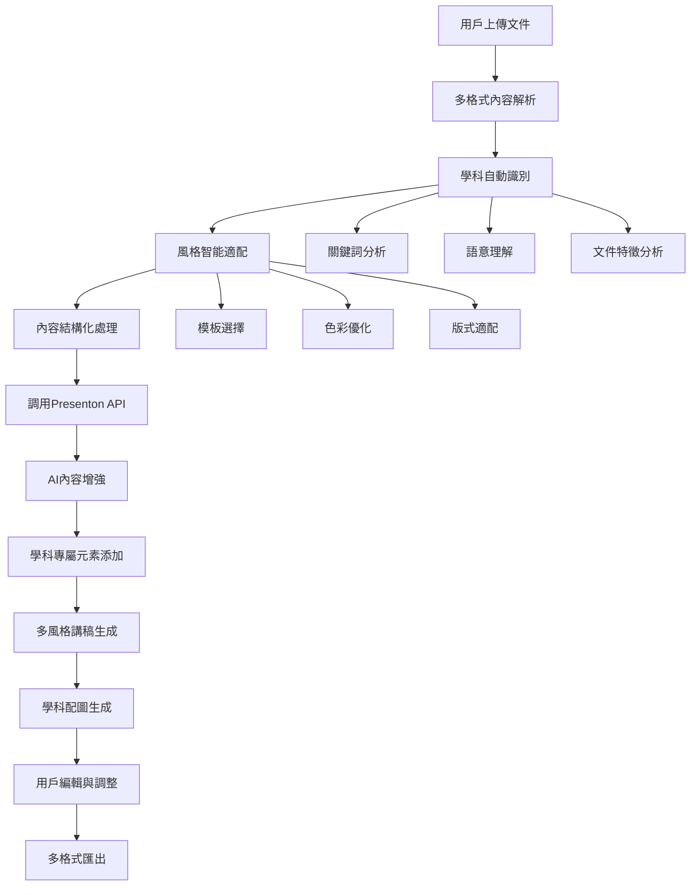

# TeachAssistant.AI 三層架構設計 (重新規劃版)

## 🎯 架構總覽 - 學科導向設計
```
┌─────────────────────────────────────────────────────────────┐
│              Presentation Layer (前端展示層)                  │
│        學科專用UI組件 + 風格切換 + 響應式設計                    │
└─────────────────────────────────────────────────────────────┘
                                ↕
┌─────────────────────────────────────────────────────────────┐
│             Business Logic Layer (智能中間層)               │
│     學科識別引擎 + Presenton整合 + 多LLM協調 + 風格適配        │
└─────────────────────────────────────────────────────────────┘
                                ↕
┌─────────────────────────────────────────────────────────────┐
│            Data & AI Service Layer (數據與AI服務層)          │
│       學科模板庫 + AI模型集群 + 文件存儲 + 風格配置庫          │
└─────────────────────────────────────────────────────────────┘
```

---

## 🖥️ 第一層：Presentation Layer (前端展示層)

### 核心技術棧
- **框架**: Next.js 14 + TypeScript + React 18
- **樣式**: Tailwind CSS + 學科主題變量系統
- **狀態管理**: Zustand + 學科上下文管理
- **UI組件**: Headless UI + 學科定制組件庫

### 學科導向的前端架構
```typescript
src/
├── components/
│   ├── SubjectAware/              # 學科感知組件
│   │   ├── ScienceComponents/     # 自然科學專用組件
│   │   │   ├── FormulaEditor/     # 公式編輯器
│   │   │   ├── DiagramGenerator/  # 科學圖表生成器
│   │   │   └── ExperimentFlow/    # 實驗流程組件
│   │   ├── SocialComponents/      # 社會學科專用組件
│   │   │   ├── TimelineView/      # 歷史時間軸
│   │   │   ├── MapVisualize/      # 地理圖表
│   │   │   └── ConceptMapping/    # 概念關聯圖
│   │   └── ArtComponents/         # 藝術教育專用組件
│   │       ├── ColorPalette/      # 色彩選擇器
│   │       ├── StylePreview/      # 風格預覽
│   │       └── CreativeTools/     # 創作工具
│   ├── Universal/                 # 通用組件
│   │   ├── FileUpload/           # 多格式文件上傳
│   │   ├── PPTEditor/            # 通用簡報編輯器
│   │   └── ProgressTracker/      # 生成進度追蹤
├── themes/                       # 學科主題系統
│   ├── science.theme.ts          # 科學類主題配置
│   ├── social.theme.ts           # 社會類主題配置
│   ├── arts.theme.ts             # 藝術類主題配置
│   └── universal.theme.ts        # 通用主題配置
├── hooks/
│   ├── useSubjectDetection.ts    # 學科自動識別
│   ├── useStyleAdaptation.ts     # 風格自適應
│   └── usePresentation.ts        # 簡報生成統一接口
└── stores/
    ├── subjectStore.ts           # 學科狀態管理
    ├── styleStore.ts             # 風格配置管理
    └── contentStore.ts           # 內容狀態管理
```

### 學科差異化UI特性
```typescript
// 學科風格配置範例
interface SubjectTheme {
  primary: string;
  secondary: string;
  accent: string;
  layouts: LayoutConfig[];
  typography: TypographyConfig;
  componentVariants: ComponentVariant[];
}

const scienceTheme: SubjectTheme = {
  primary: "#2563EB", // 科技藍
  secondary: "#059669", // 實驗綠
  accent: "#DC2626", // 警示紅
  layouts: ["diagram-focused", "formula-heavy", "experiment-flow"],
  typography: { 
    heading: "Inter", 
    body: "Inter", 
    code: "JetBrains Mono" 
  },
  componentVariants: ["formula-card", "process-diagram", "data-visualization"]
};
```

---

## ⚙️ 第二層：Business Logic Layer (智能中間層)

### 核心技術棧
- **主框架**: FastAPI + Python 3.11
- **學科引擎**: 自研學科識別系統
- **任務處理**: Celery + Redis Queue
- **AI協調**: 多LLM智能路由系統

### 服務模組架構 (學科導向)
```python
app/
├── api/v1/
│   ├── presentations/            # 簡報生成API
│   ├── subjects/                # 學科識別與配置API
│   ├── styles/                  # 風格管理API
│   └── integrations/            # 外部整合API
│       └── presenton/          # Presenton客戶端
├── services/
│   ├── subject_detection/       # 學科自動識別服務
│   │   ├── content_analyzer.py  # 內容分析器
│   │   ├── keyword_classifier.py # 關鍵詞分類器
│   │   └── ml_classifier.py     # 機器學習分類器
│   ├── style_adaptation/        # 風格自適應服務
│   │   ├── template_selector.py # 模板選擇器
│   │   ├── color_optimizer.py   # 色彩優化器
│   │   └── layout_adapter.py    # 版式適配器
│   ├── ai_orchestrator/         # AI模型協調服務
│   │   ├── llm_router.py       # LLM智能路由
│   │   ├── model_selector.py   # 模型選擇策略
│   │   └── prompt_optimizer.py # 提示詞優化
│   ├── content_processor/       # 內容處理流水線
│   │   ├── multi_file_merger.py # 多文件整合
│   │   ├── subject_extractor.py # 學科特徵提取
│   │   └── structure_analyzer.py # 內容結構分析
│   └── presenton_integration/   # Presenton整合服務
│       ├── api_client.py       # API客戶端
│       ├── content_mapper.py   # 內容映射器
│       └── enhancement_layer.py # AI增強層
├── models/
│   ├── subject.py              # 學科數據模型
│   ├── style_config.py         # 風格配置模型
│   ├── presentation.py         # 簡報數據模型
│   └── template.py             # 模板數據模型
└── utils/
    ├── subject_utils.py        # 學科工具函數
    ├── style_utils.py          # 風格工具函數
    └── content_utils.py        # 內容處理工具
```

### 核心業務邏輯：學科智能識別與風格適配

#### 1. 學科智能識別引擎
```python
class SubjectDetectionEngine:
    def __init__(self):
        self.keyword_classifier = KeywordClassifier()
        self.ml_classifier = MLClassifier()  # 使用輕量級分類模型
        self.content_analyzer = ContentAnalyzer()
        
    async def detect_subject(self, content: str, files: List[File]) -> SubjectClassification:
        """
        多層次學科識別
        1. 關鍵詞匹配 (快速初判)
        2. 內容語意分析 (深度理解)
        3. 文件格式分析 (輔助判斷)
        """
        # 關鍵詞快速分類
        keyword_result = self.keyword_classifier.classify(content)
        
        # 深度語意分析
        semantic_result = await self.content_analyzer.analyze_semantics(content)
        
        # 文件特徵分析
        file_features = self.extract_file_features(files)
        
        # 多源融合決策
        final_classification = self.fusion_decision(
            keyword_result, semantic_result, file_features
        )
        
        return SubjectClassification(
            primary_subject=final_classification.primary,
            confidence=final_classification.confidence,
            secondary_subjects=final_classification.secondary,
            recommended_style=final_classification.style_preference
        )

# 學科關鍵詞庫配置
SUBJECT_KEYWORDS = {
    "natural_science": {
        "physics": ["物理", "力學", "電磁", "量子", "波動", "能量"],
        "chemistry": ["化學", "分子", "原子", "反應", "化合物", "元素"],
        "biology": ["生物", "細胞", "基因", "進化", "生態", "器官"],
        "mathematics": ["數學", "幾何", "代數", "微積分", "統計", "函數"]
    },
    "social_science": {
        "history": ["歷史", "朝代", "戰爭", "文明", "革命", "古代"],
        "geography": ["地理", "氣候", "地形", "國家", "城市", "地圖"],
        "economics": ["經濟", "市場", "貿易", "金融", "投資", "GDP"],
        "politics": ["政治", "政府", "選舉", "法律", "制度", "民主"]
    },
    "arts_education": {
        "fine_arts": ["美術", "繪畫", "雕塑", "色彩", "構圖", "藝術史"],
        "music": ["音樂", "樂器", "旋律", "和聲", "節拍", "作曲"],
        "literature": ["文學", "詩歌", "小說", "散文", "修辭", "作者"]
    }
}
```

#### 2. 風格自適應系統
```python
class StyleAdaptationService:
    def __init__(self):
        self.template_selector = TemplateSelector()
        self.color_optimizer = ColorOptimizer()
        self.layout_adapter = LayoutAdapter()
        
    async def adapt_style(self, 
                         subject: SubjectClassification,
                         content: ProcessedContent) -> StyleConfiguration:
        """
        根據學科特性自動適配風格
        """
        # 選擇學科專屬模板
        template_config = await self.template_selector.select(
            subject=subject.primary_subject,
            content_type=content.type,
            complexity=content.complexity_level
        )
        
        # 優化色彩配置
        color_scheme = self.color_optimizer.optimize(
            subject=subject.primary_subject,
            base_template=template_config,
            content_mood=content.emotional_tone
        )
        
        # 適配版式設計
        layout_config = self.layout_adapter.adapt(
            subject=subject.primary_subject,
            content_structure=content.structure,
            visual_elements=content.visual_requirements
        )
        
        return StyleConfiguration(
            template=template_config,
            colors=color_scheme,
            layout=layout_config,
            typography=self.get_subject_typography(subject.primary_subject),
            visual_elements=self.get_subject_visual_elements(subject.primary_subject)
        )

# 學科風格配置
SUBJECT_STYLE_CONFIG = {
    "natural_science": {
        "color_palette": ["#2563EB", "#059669", "#DC2626", "#7C3AED"],
        "typography": {"primary": "Inter", "secondary": "JetBrains Mono"},
        "layout_preference": "diagram-heavy",
        "visual_elements": ["formula_blocks", "process_diagrams", "data_charts"],
        "icon_style": "outline-technical"
    },
    "social_science": {
        "color_palette": ["#B45309", "#DC2626", "#059669", "#2563EB"],
        "typography": {"primary": "Noto Sans TC", "secondary": "serif"},
        "layout_preference": "text-rich",
        "visual_elements": ["timelines", "maps", "concept_networks"],
        "icon_style": "solid-academic"
    },
    "arts_education": {
        "color_palette": ["#DB2777", "#7C3AED", "#059669", "#F59E0B"],
        "typography": {"primary": "Playfair Display", "secondary": "Inter"},
        "layout_preference": "visual-first",
        "visual_elements": ["galleries", "color_swatches", "creative_blocks"],
        "icon_style": "rounded-creative"
    }
}
```

#### 3. Presenton API 智能整合層
```python
class EnhancedPresentonClient:
    def __init__(self):
        self.base_url = "http://presenton-api:5000"
        self.ai_enhancer = AIContentEnhancer()
        
    async def create_subject_aware_presentation(self, 
                                             content: ProcessedContent,
                                             subject_config: SubjectClassification,
                                             style_config: StyleConfiguration) -> PresentationResult:
        """
        結合學科特性的Presenton API調用
        """
        # 1. 將內容適配為Presenton格式
        presenton_content = self.format_for_presenton(content, subject_config)
        
        # 2. 調用Presenton API生成基礎簡報
        base_presentation = await self.call_presenton_api({
            "content": presenton_content,
            "template": style_config.template.presenton_template,
            "tone": self.map_subject_to_tone(subject_config.primary_subject),
            "n_slides": content.estimated_slides,
            "language": "Chinese",
            "export_as": "pptx"
        })
        
        # 3. 使用AI增強簡報內容
        enhanced_presentation = await self.ai_enhancer.enhance_presentation(
            base_presentation=base_presentation,
            subject_config=subject_config,
            style_config=style_config,
            original_content=content
        )
        
        # 4. 添加學科專屬元素
        final_presentation = await self.add_subject_specific_elements(
            enhanced_presentation,
            subject_config
        )
        
        return final_presentation
    
    def map_subject_to_tone(self, subject: str) -> str:
        """將學科映射到Presenton的tone參數"""
        mapping = {
            "natural_science": "educational",
            "social_science": "professional", 
            "arts_education": "casual"
        }
        return mapping.get(subject, "educational")
```

---

## 🗄️ 第三層：Data & AI Service Layer (數據與AI服務層)

### 數據存儲架構 (學科導向)
```
├── PostgreSQL (關聯數據)
│   ├── subjects                 # 學科分類配置
│   ├── subject_templates        # 學科模板庫
│   ├── style_configurations     # 風格配置表
│   ├── presentations           # 簡報元數據
│   ├── user_preferences        # 用戶學科偏好
│   └── subject_keywords        # 學科關鍵詞庫
├── MongoDB (非結構化數據)
│   ├── content_analysis_cache  # 內容分析緩存
│   ├── subject_detection_logs  # 學科識別日誌
│   ├── style_adaptation_cache  # 風格適配緩存
│   └── ai_model_outputs       # AI模型輸出記錄
├── MinIO/S3 (文件與資源存儲)
│   ├── uploaded_files/         # 用戶上傳文件
│   ├── subject_templates/      # 學科模板文件
│   │   ├── science/           # 自然科學模板
│   │   ├── social/            # 社會科學模板
│   │   └── arts/              # 藝術教育模板
│   ├── generated_presentations/ # 生成的簡報
│   ├── subject_assets/         # 學科專用素材庫
│   │   ├── science_icons/     # 科學圖標庫
│   │   ├── social_maps/       # 社會學科地圖庫
│   │   └── arts_palettes/     # 藝術色彩庫
│   └── style_resources/        # 風格資源庫
└── Redis (緩存與隊列)
    ├── subject_detection_cache # 學科識別結果緩存
    ├── style_config_cache     # 風格配置緩存
    ├── template_cache         # 模板緩存
    └── celery_queues          # 異步任務隊列
```

### AI模型服務集群 (學科特化)
```
├── 語言模型集群
│   ├── Phi-4 (Microsoft)           # 輕量級推理，快速分類
│   ├── GPT-OSS 20B                 # 強語言理解，內容生成
│   ├── Zephyr 7B / Breeze-7b-ins   # 中文對話，講稿生成
│   └── Subject-Specific Fine-tuned  # 學科專用微調模型
│       ├── ScienceLLM              # 科學領域專用
│       ├── SocialLLM               # 社會科學專用
│       └── ArtsLLM                 # 藝術教育專用
├── 視覺模型集群
│   ├── Stable Diffusion XL         # 通用圖像生成
│   ├── Subject-Specialized SDXL    # 學科專用圖像生成
│   │   ├── Science-SDXL           # 科學圖表生成
│   │   ├── Social-SDXL            # 社會科學插圖
│   │   └── Arts-SDXL              # 藝術風格生成
│   ├── BLIP-2                     # 圖像理解
│   └── GPT-4o mini                # 多模態理解
├── 分類與分析模型
│   ├── Subject Classifier          # 學科分類器
│   ├── Content Analyzer           # 內容分析器
│   ├── Style Recommender          # 風格推薦器
│   └── Quality Assessor           # 品質評估器
└── 部署平台
    ├── Ollama (本地LLM部署)
    ├── ComfyUI (圖像生成工作流)
    ├── Hugging Face Transformers
    └── Custom Model Server (學科特化模型)
```

### 學科模板與資源庫
```python
# 學科模板配置
SUBJECT_TEMPLATES = {
    "natural_science": {
        "physics": {
            "slide_layouts": ["title-formula", "diagram-explanation", "experiment-process"],
            "color_schemes": ["physics_blue", "energy_gradient", "particle_theme"],
            "visual_elements": ["formula_blocks", "vector_diagrams", "wave_patterns"],
            "icon_sets": ["physics_symbols", "lab_equipment", "measurement_tools"]
        },
        "chemistry": {
            "slide_layouts": ["reaction-equation", "molecular-structure", "lab-procedure"],
            "color_schemes": ["chemistry_green", "periodic_table", "reaction_colors"],
            "visual_elements": ["molecular_models", "reaction_arrows", "lab_diagrams"],
            "icon_sets": ["chemical_symbols", "lab_glassware", "safety_icons"]
        }
    },
    "social_science": {
        "history": {
            "slide_layouts": ["timeline-events", "map-overlay", "comparison-table"],
            "color_schemes": ["historical_sepia", "dynasty_colors", "vintage_palette"],
            "visual_elements": ["timelines", "historical_maps", "period_artwork"],
            "icon_sets": ["historical_symbols", "cultural_icons", "political_emblems"]
        },
        "geography": {
            "slide_layouts": ["map-central", "climate-data", "population-stats"],
            "color_schemes": ["earth_tones", "climate_zones", "topographic_colors"],
            "visual_elements": ["world_maps", "climate_charts", "demographic_graphs"],
            "icon_sets": ["geographic_symbols", "weather_icons", "landmark_icons"]
        }
    },
    "arts_education": {
        "fine_arts": {
            "slide_layouts": ["artwork-showcase", "technique-demo", "color-theory"],
            "color_schemes": ["artist_palette", "color_harmony", "creative_spectrum"],
            "visual_elements": ["artwork_galleries", "color_wheels", "brush_strokes"],
            "icon_sets": ["art_tools", "technique_symbols", "style_indicators"]
        }
    }
}
```

---

## 🔄 完整工作流程 (學科感知版)

### 智能化處理流程


### 學科特化處理邏輯
```python
async def process_educational_content(files: List[File], user_preferences: UserPreferences) -> PresentationResult:
    """
    教育內容智能處理主流程
    """
    # 1. 內容解析與預處理
    parsed_content = await parse_multiple_files(files)
    
    # 2. 學科智能識別
    subject_classification = await subject_detection_engine.detect_subject(
        content=parsed_content.text,
        files=files
    )
    
    # 3. 風格自動適配
    style_config = await style_adaptation_service.adapt_style(
        subject=subject_classification,
        content=parsed_content,
        user_preferences=user_preferences
    )
    
    # 4. 內容結構化與增強
    structured_content = await content_processor.structure_content(
        content=parsed_content,
        subject=subject_classification,
        target_style=style_config
    )
    
    # 5. Presenton API集成與生成
    base_presentation = await enhanced_presenton_client.create_subject_aware_presentation(
        content=structured_content,
        subject_config=subject_classification,
        style_config=style_config
    )
    
    # 6. 學科專屬增強
    enhanced_presentation = await subject_enhancer.enhance_with_subject_specifics(
        presentation=base_presentation,
        subject=subject_classification,
        content=structured_content
    )
    
    # 7. 多樣化講稿生成
    speech_scripts = await speech_generator.generate_multi_style_scripts(
        presentation=enhanced_presentation,
        styles=["formal", "conversational", "educational"],
        subject=subject_classification
    )
    
    # 8. 學科配圖生成
    subject_images = await image_generator.generate_subject_images(
        presentation=enhanced_presentation,
        subject=subject_classification,
        style=style_config
    )
    
    return PresentationResult(
        presentation=enhanced_presentation,
        speech_scripts=speech_scripts,
        generated_images=subject_images,
        subject_classification=subject_classification,
        style_config=style_config,
        metadata={
            "processing_time": time.time() - start_time,
            "confidence_scores": subject_classification.confidence,
            "enhancements_applied": enhanced_presentation.enhancements
        }
    )
```

---

## 🚀 部署架構 (容器化 + 學科模組化)

### Docker Compose 配置
```yaml
version: '3.8'
services:
  # 前端服務
  frontend:
    build: ./frontend
    ports: ["3000:3000"]
    environment:
      - NEXT_PUBLIC_SUBJECT_THEMES_ENABLED=true
    
  # 業務邏輯API
  api:
    build: ./backend
    ports: ["8000:8000"]
    environment:
      - ENABLE_SUBJECT_DETECTION=true
      - ENABLE_STYLE_ADAPTATION=true
    
  # 學科識別服務
  subject-service:
    build: ./subject-service
    ports: ["8001:8001"]
    volumes:
      - ./models/subject-models:/app/models
    
  # AI模型服務集群
  ollama-general:
    image: ollama/ollama
    volumes: ["./models/general:/root/.ollama"]
    
  ollama-science:
    image: ollama/ollama
    volumes: ["./models/science:/root/.ollama"]
    
  ollama-social